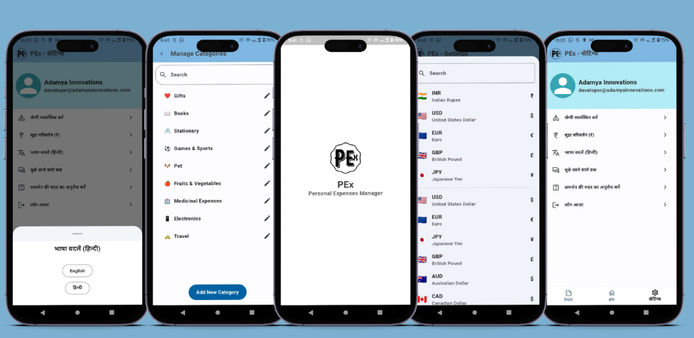
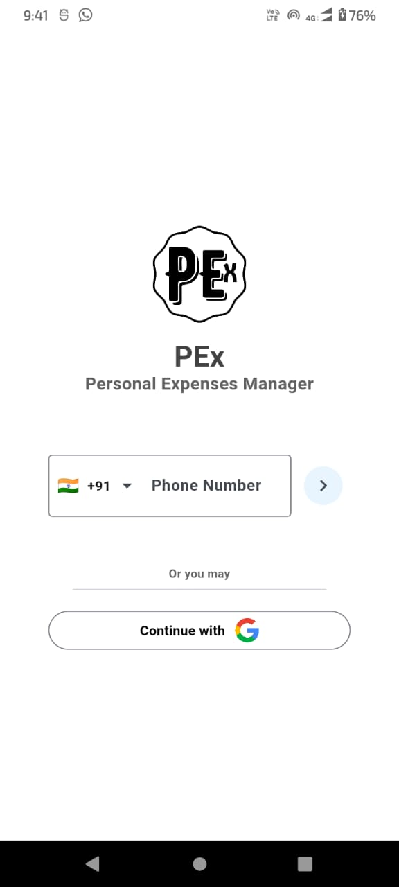
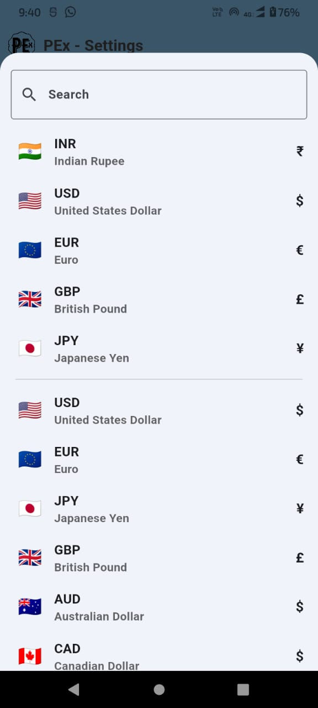
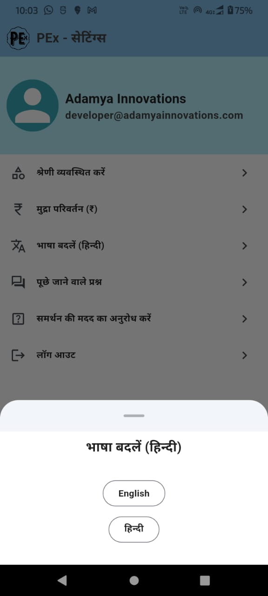
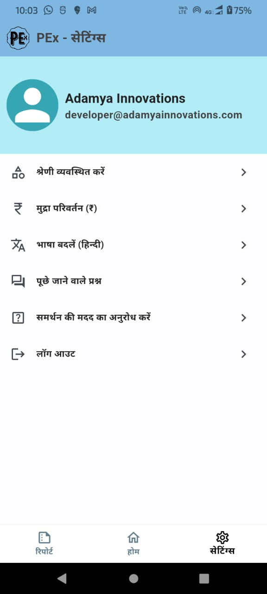
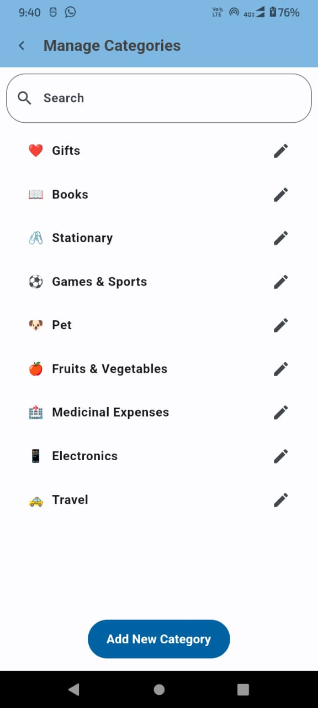

# PEx - Personal Expense Manager

Welcome to PEx, your ultimate financial management companion! PEx offers seamless expense tracking, income management, and debt monitoring to empower your financial journey.

## Download the APK
<a href="https://github.com/shubhamranswal/PEx-PersonalExpenseManager/releases/download/APK/app-release.apk">Download PEx APK</a>
- For testing, sign in as +91 9560793525 and pin as 120920, since several deives might not support older version of Phone Auth.

 


## Features



- **Bilingual Support**: Enjoy a user-friendly experience in multiple languages.
- **Secure Login**: Flexible login options using email or phone number, with robust security measures.
- **Cross-Device Synchronization**: Access your financial data consistently across all devices.
- **Detailed Reports**: Visualize your expenses, income, and savings through graphs and charts.
- **Customizable Categories**: Tailor your expense categories to fit your unique needs.
- **Multi-Currency Support**: Handle transactions effortlessly in different currencies.

## Main Purpose

- **Expense Tracking**: Easily record and manage your daily expenses.
- **Financial Insights**: Gain valuable insights into your spending and income patterns.
- **Debt Management**: Keep track of debts owed and payments due.
- **Customizable Interface**: Adjust settings to match your preferences.

## Key Features

- Financial Empowerment
- User-Friendly Interface
- Security Matters
- Personalized Insights
- Comprehensive Features
- Communication Hub
- Continuous Improvement
- Accessible Support
- Easy Login
- Financial Success

## Supported Platforms

PEx is available for both **iOS** and **Android** devices.

## Techstack

| **Flutter** | **Firebase** | **Figma** |
| --- | --- |  --- |

## Screenshots

Here’s a preview of the PEx app:

|  |  |  |
|:-----------------------------------:|:---------------------------------------:|:-----------------------------------------:|
|  |  |  |

## Installation

1. Clone the repository:
   ```bash
   git clone https://github.com/shubhamranswal/PEx-PersonalExpenseManager.git
   ```
2. Navigate to the project directory:
   ```bash
   cd PEx
   ```
3. Install dependencies:
   ```bash
   flutter pub get
   ```
4. Run the app:
   ```bash
   flutter run
   ```

## Contributions

We love contributions! If you have ideas for new features or improvements, feel free to open an issue or submit a pull request. Let's make this app even better together!

## License

This project is licensed under the MIT License - see the [LICENSE](LICENSE) file for details.

## Contact

For any inquiries, please reach out to [shubhamranswal@gmail.com](mailto:shubhamranswal@gmail.com).